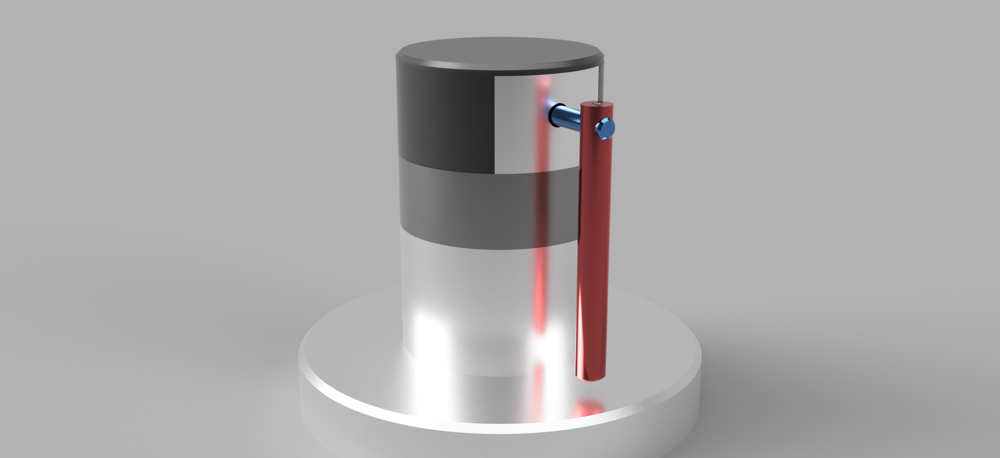

# Furuta-Pendulum

Period: November 20, 2024 → May 1, 2025
Skills: 3D Printing, BLDC Motor, C/C++, CNC Machining, Embedded System, FOC Control, MATLAB, Oscilloscope, PID, State Space Control



# Background

This documentation is written to provide guidelines who’re trying to create their own pendulum model and also serve as my personal notes to organize theories I learned. 

Rotary Pendulum, also known as [Furuta Pendulum](https://en.wikipedia.org/wiki/Furuta_pendulum) is often used as an example in control system theory. It has a pendulum attached to rotary arm which can be controlled directly by a motor. 

The structure may be simple, but its dynamics are highly nonlinear making it harder to control.

I first came across to Furuta Pendulum in Control System Lab where we worked with the [Quanser Motion System pendulum module](https://www.quanser.com/products/qube-servo-3/) and the TMS320F2837xD Dual-Core Microcontroller from TI. The objective of the lab was Plant modeling with Pendulum Load and develop regulator position for the arm while balancing the pendulum. After finishing the lab, I wanted to learn more and build my own pendulum model from scratch.

What seemed like a straightforward task turned out to be far more challenging than I had expected and required a wide range of skills to accomplish. It involved understanding laws of physicsl, 3D printing skils, designing the control system, and implementing BLDC motor control.

The goal of this project is to build my own Furuta pendulum model only using basic components and to understand the fundamental theories behind its operation.

[Video of the pendulum controller implementation from Control System Design Lab.](Furuta%20Pendulum%201ad85b60c5ba803d8245d76d0159d2ae/IMG_4875.mov)

Video of the pendulum controller implementation from Control System Design Lab.

# Deriving Dynamics Model

This section presents the system dynamics of a pendulum using Lagrange’s method. The equations were derived using MATLAB’s Symbolic Toolbox, and the corresponding MATLAB code is provided in Appendix A.

Consider a rotational pendulum consisting of a rotating arm and a pendulum, as illustrated in Figure 1. The brushless motor (BLDC) is used to apply torque $\tau$ to arm and pendulum is free to rotate but not actuated. 


Figure 1. Schematic of the Furuta Pendulum system.


Figure 2. Side view defining parameters.


Figure 3. Top view of the Arm and Pendulum

The center of mass of the pendulum can be expressed in the Cartesian coordinate system as follows:

$$
\begin{pmatrix}
x_p\\
y_p\\
z_p
\end{pmatrix} = \begin{pmatrix}L_1 \cos(\theta_1) - l_2 \sin(\theta_2) \sin(\theta_1)\\
L_1 \sin(\theta_1) + l_2 \sin(\theta_2) \cos(\theta_1)\\
-l_2 \cos(\theta_2)
\end{pmatrix}
$$

By differentiating, we obtain the following velocity vector:

$$
v=\begin{pmatrix}
\dot{x_p}\\
\dot{y_p}\\
\dot{z_p}
\end{pmatrix} = \begin{pmatrix}

-\dot{\theta}_1 \left( L_1 \sin(\theta_1) + l_2 \cos(\theta_1) \sin(\theta_2) \right) - l_2 \dot{\theta}_2 \cos(\theta_2) \sin(\theta_1) \\

\dot{\theta}_1 \left( L_1 \cos(\theta_1) - l_2 \sin(\theta_1) \sin(\theta_2) \right) + l_2 \dot{\theta}_2 \cos(\theta_1) \cos(\theta_2)\\

l_2 \dot{\theta}_2 \sin(\theta_2)

\end{pmatrix}
$$

Note that $v^2 = v' * v$.

Kinetic energy of the motor $T_0$ and rotary arm $T_1$ is given by:

$$
T_0 = \dfrac{1}{2} * J_0 * \dot{\theta_1}^2
$$

$$
T_1 = \dfrac{1}{2} * J_1 * \dot{\theta_1}^2
$$

Kinetic energy energy of the pendulum is given by:

$$
T_2  = \dfrac{1}{2} * \dot{\theta_2}^2 + \dfrac{1}{2} * m_2 * v^2
$$

Total kinetic energy is:

$$
T = T_0 + T_1 + T_2
$$

Total potential energy is:

$$
U = m_2 * g * z_p
$$

The Lagrangian is the difference in kinetic and potential energies:

$$
\mathcal{L} = T - U
$$

The equations of motion are determined from Lagrangian by evaluating Euler-Lagrange equation:

$$
\frac{d}{dt}\!\biggl(\frac{\partial \mathcal{L}}{\partial \dot{\theta}_i}\biggr)
 \;-\;
\frac{\partial \mathcal{L}}{\partial \theta_i}
 \;=\;
\mu_i,
\quad
i \in \{1,2\}.
$$

# State Space Control

## Linearization of a Nonlinear System

In this section, we will transform the nonlinear model into a linear state-space representation and analyze its controllability and observability. Subsequently, we will implement an LQR controller to stabilize the pendulum in the inverted position and simulate the system using MATLAB.

Before proceeding, I will assume that readers have a basic understanding of state-space control. If not, I recommend watching the *Control Bootcamp* series by [Steve Brunton](https://www.youtube.com/watch?v=Pi7l8mMjYVE&list=PLMrJAkhIeNNR20Mz-VpzgfQs5zrYi085m) [2], which provides an excellent introduction to state-space control concepts.

In the previous section, we derived the dynamic model in terms of force. However, the dynamics are nonlinear, and we need to linearize the system around a stable position. In this case, there are two stable positions: the hanging down position $(\theta_2 = 0)$, and the inverted position $(\theta_2 = \pi)$.

We’re interested in controlling the pendulum in inverted position $\theta_2 = \pi$, so we will linearize the system only at this point.

We introduce state variables as following:

$$
x = \begin{bmatrix}
\theta_1\\
\theta_2\\
\dot{\theta_1}\\
\dot{\theta_2}
\end{bmatrix}
$$

## **Controllability and Observability of the System**

Since we don’t have precise measruements for mass and dimensions, we will assume certain parameters based on the 3D design. Evaluating the system’s controllability and observability before manufacturing will help in determining the appropriate model size and motor specifications later.

We have following state space system:

$$
\dot{x} = Ax+Bu\\
y = Cx + D
$$

If we choose our input $u = -kx$, the system can be represented as:

$$
\dot{x} = (A-Bk)x
$$

The system is controllabe if we can place eigenvalues of $A-Bk$ anywhere we want with good choice of $k$.

In state space model, the system is controllable if the controllability matrix $\mathcal{C}$ has full rank of n where n is the number of state variables. 

$$
\mathcal{C} = [B\ AB\ A^2B\ \cdots\ A^{n-1}B]
$$

In MATLAB, the controllability can be determined using the commands `rank(ctrb(A,B))`

if the output matches with the number of state variables, in this case n = 4, the system is controllable. 

## Regulator Design

## **State Estimation and Observer Design**

To control the system with the input  $u = -kx$ , we need to know the full state of our system. In our pendulum model, two encoders directly measure the arm angle and the pendulum angles,  $\theta_1$  and  $\theta_2$. However, the angular velocities  $\dot{\theta_1}, \dot{\theta_2}$ need to be estimated.

To get angular velocity with the angular postion, we can simply differentate the position with respect to time like following:

$$
\frac{d\theta}{dt} = \frac{\theta_k - \theta_{k-1}}{\Delta t}
$$

However, differentiation in the time domain corresponds to multiplication by s in the Laplace domain, which amplifies the high-frequency noise. 

In our model, I used the same approximate differentiator I used in Control System Lab where its transfer function can be described as:

$$
H_e(s) = \frac{\lambda_e s}{s + \lambda_e},\quad \lambda_e > 0
$$

This transfer function would behave as a normal differentiator for low frequencies $H_e(s) \approx s$ when $s \ll \lambda_e$ and limits the gain for higher frequencies $H_e(s) \approx \lambda_e$ when $s \gg \lambda_e$.

The state-space representation of the estimator is:

$$
\dot{x} = ax(t)+by(t) \\
\hat{y} = cx(t) + dy(t)
$$

where the state-space coefficients are:

$$
a = -\lambda_e, \quad b=-\lambda_e^2, \quad c = 1, \quad d = \lambda_e.
$$

## **Energy-Based swing-up control**

In this section, we will implement the swing-up motion using energy control. The swing-up behavior is characterized by the ratio n of the maximum acceleration of the pivot to the acceleration due to gravity [3].

In this model, I used following control law for swing up motion:

$$
u = k(E - E_0)*\dot{\theta}*cos(\theta)
$$

[Pendulum swing up and balancing simulation using Simulink.](Furuta%20Pendulum%201ad85b60c5ba803d8245d76d0159d2ae/Untitled.mov)

Pendulum swing up and balancing simulation using Simulink.

# Manufacturing

## 3D modeling


Figure 1. Furuta Pendulum Model with inverted position.


Figure 2. Close up with Rotary Arm attached to ball bearing.


Figure 3. Rotary Arm has attached to optical encoder for pendulum angle measurement.


Figure 4. Sectional analysis with xy plane, AS5600 magnetic encoder has attached to the bottom of the motor.


Figure 5. Bottom plate where usb-c break board and main controller are located.


Figure 6. Rotary Pendulum with screws.

## 3D printing & Painting

The final model will have only three 3D-printed parts: the encoder housing, top cover, and bottom cover, while all other parts will be CNC machined. To ensure proper functionality and design validation before machining, it would be advantageous to 3D print all components prior to CNC processing and it turned out the design had design flaws that required mulitple modifications.

All parts are 3D printed using the Bambu P1S printer located in the [Hive](https://hive.ece.gatech.edu/), the ECE makerspace. 


Figure 7. 3D printed parts using Bambu P1S printer.

[3D printing video for prototyping.](Furuta%20Pendulum%201ad85b60c5ba803d8245d76d0159d2ae/IMG_5503.mov)

3D printing video for prototyping.


Figure 8. Painting booth in ECE maker space.


Figure 9. Painting 3d printed top cover using spray paint.

## CNC machining


Figure 10. Lathe training & Testing


Figure 11. CNC machined parts.

## Schematic Design


Figure 12. Schematic Design of MKS ESP32 FOC Driver Board.

# Determining Parameter Values

## Numerical approximation

[https://en.wikipedia.org/wiki/List_of_moments_of_inertia](https://en.wikipedia.org/wiki/List_of_moments_of_inertia)

| Name | Material | Mass $(kg)$ | Inertia $(kg\cdot m^2)$ |
| --- | --- | --- | --- |
| Top cover | Plastic |  |  |
| Encoder | Steel |  |  |
| Arm Mount | Aluminum 6061 |  |  |
| Ball bearing | Steel |  |  |

## Approximating moment of inertia


Figure 13. Simulated inertia and mass of the top cover in Fusion 360.


Figure 14. Simulated inertia and mass of the encoder in Fusion 360.


Figure 15. Simulated inertia and mass of the arm mount in Fusion 360.

Table I. Mechanical properties of parts from Fusion 360.

| Name | Material | Mass $(kg)$ | Inertia $(kg\cdot m^2)$ |
| --- | --- | --- | --- |
| Top cover | Plastic | 0.018982 | $1.35324\times 10^{-5}$ |
| Encoder | Steel | 0.016612 | $5.34439\times 10^{-6}$ |
| Arm Mount | Aluminum 6061 | 0.026025 | $1.783786 \times 10^{-5}$ |

Table II. Mass measurements of components.

| Name | Material | Mass $(kg)$ |
| --- | --- | --- |
| Top cover | Plastic | 0.0217 |
| Arm Mount | Aluminum 6061 | 0.0272 |
| Pendulum | Aluminum 6061 | 0.0128 |
| Rotray Arm | Aluminum 6061 | 0.0038 |

The inertia of fasteners, ball bearing and magnets is neglected. Despite multiple inquiries to the motor manufacturer, they were unable to provide the rotor’s inertia or mass. The measurement of the rotor’s inertia will be covered in the motor characterization section.

# Motor Controller Design

## FOC Control

Previously, we successfully derived the state-space model of the system with torque as the input.

However, torque control for a BLDC motor proved to be a significant challenge in this project. Fortunately, I found an open-source FOC library called SimpleFOC [3] and a compatible controller board. Nevertheless, to ensure seamless integration and optimal performance, I needed to understand the underlying theory behind Field-Oriented Control (FOC).

For motor control, I suggest to watch Motor Control Lectures by [Dave Wilson](https://www.youtube.com/watch?v=fpTvZlnrsP0) [4].

Field Oriented Control (FOC) is suitable since it enables precise control of torque and speed by decoupling the motor’s stator current into two components: torque-producing and flux-producing.

[BLDC motor test with closed loop angle control.](Furuta%20Pendulum%201ad85b60c5ba803d8245d76d0159d2ae/IMG_5627.mov)

BLDC motor test with closed loop angle control.

## Characterizing BLDC motor

### Torque Constant (Line-to-Line Back-EMF)

To control motor torque via current, the torque constant was required. I used a GM5208-12 motor, but surprisingly, the manufacturer did not include this information in the datasheet. After reaching out to inquire about it and receiving no response, I measured the torque constant myself.

The goal was to measure $V_{rms}$ by rotating the motor at a constant speed. Using a cordless drill and an encoder, I was able to achieve a stable rotation speed, and the line-to-line back-EMF was measured with an oscilloscope.

$$
K_e = \dfrac{V_{rms}}{\sqrt3*\omega}
$$


Figure 12. Cordless drill attached to the motor.


Figure 13. $V_{rms}$ measurement using oscilloscope.

I’ve tested with different rpm and measured $V_{rms}$ each time with oscilloscope.

Table III. Torque constant with different RPM.

| RPM | $V_{rms}$ | $\omega (rad/s)$ | Torque Constant $(N\cdot m/A)$ |
| --- | --- | --- | --- |
| 429 | 20.4 | 44.9247749 | 0.26217807 |
| 423 | 21.3 | 44.2964564 | 0.27762766 |
| 323 | 17.2 | 33.8244809 | 0.29359552 |
| 267 | 13.6 | 27.9151451 | 0.28128795 |
| 381 | 18.2 | 39.8982267 | 0.26337218 |
| 252 | 12.4 | 26.3893783 | 0.27129678 |
| 309 | 16.1 | 32.3584043 | 0.28727041 |

Torque Constant: 0.277 $N\cdot m/A$

### Rotor Inertia


Figure 14. Step current input of 0.2A.


Figure 15. Motor’s rotor velocity over time with step torque input.

After applying $\tau = 0.0554\ N\cdot m$ at $t = 3s$, the motor starts to accelerate. 


Figure 16. Linear regression of the velocity with 0.2A of current input.

I applied a current of 0.2A and measured the rotor velocity using an encoder. I then plotted velocity over time and performed linear regression to determine acceleration.

Once I obtained a steady acceleration, I used the formula  $T = J *\alpha$ to calculate the rotor’s inertia.

Table IV. Moment of Inertia of the Rotor at Various Current Levels.

| Current (A) | Torque Constant (N**·**m/A) | Torque Input (N**·**m) | Acceleration (rad/s^2) | Inertia
(kg**·**m^2) | $R^2$ |
| --- | --- | --- | --- | --- | --- |
| 0.1 | 0.277 | 0.0277 | 13.289 | 0.00208443 | 0.9986 |
| 0.2 | 0.277 | 0.0554 | 30.849 | 0.00179584 | 0.9987 |
| 0.3 | 0.277 | 0.0831 | 47.307 | 0.00175661 | 0.9984 |
| 0.5 | 0.277 | 0.1385 | 81.016 | 0.00170954 | 0.9975 |

I’ve conducted multiple tests with varying current inputs and selected the inertia value of `0.00179584 $kg \cdot m^2$,` which provided the best fit with an  $R^2$  value of 0.9987.

### Rotor Friction Coefficient

In a BLDC motor, the rotor is supported by ball bearings to maintain its central position, which introduces friction. Additionally, a slip ring is used to enable 360-degree rotation while transmitting encoder signals, which also introduces additional friction.

The slip ring is attached to the motor, and the friction of both the rotor and the slip ring is measured together.

Let’s assume friction is viscous (propotional to angular speed) which leads to:

$$
\tau_{friction} = b\cdot\omega
$$

With only friction acting on the system, Newton’s second law can be applied as follows:

$$
-b\cdot\omega = J\cdot\frac{d\omega}{dt}
$$

Move terms involving $\omega$ to one side:

$$
\frac{d\omega}{\omega} = -\frac{b}{J}\cdot dt
$$

Integrate both sides:

$$
\int{\frac{d\omega}{\omega}} = -\frac{b}{J}\cdot \int{dt}
$$

This yields:

$$
\ln\!\bigl|\omega(t)\bigr| = -\,\frac{b}{J}\,t + C\,
$$

The equations indicates that the slope of $\ln\!\bigl|\omega(t)|$ corresponds to the constant $-\frac{b}{J}$

After cutting the power, I measured the motor’s angular velocity as it slowed down over time. I then used Excel to perform a linear regression on $\ln(\omega)$  to analyze the decay. 


Figure 17. Linear regression of ln(**ω) on Excel.**

As figure 17 shows, the slope of  $\ln(\omega)$  was -0.2536 which corresponds to $-\frac{b}{J}$. After solving for friction constant b:

$$
b = -\ln\!\bigl|\omega(t)| \cdot J 
$$

which yields to $b = 4.554 \times 10^{-4}$

# Citations & Resources

[On the Dynamics of the Furuta Pendulum.pdf](Furuta%20Pendulum%201ad85b60c5ba803d8245d76d0159d2ae/On_the_Dynamics_of_the_Furuta_Pendulum.pdf)

[https://build-its-inprogress.blogspot.com/search/label/Pendulum](https://build-its-inprogress.blogspot.com/search/label/Pendulum)

[Swinging up a pendulum by energy control.pdf](Furuta%20Pendulum%201ad85b60c5ba803d8245d76d0159d2ae/Swinging_up_a_pendulum_by_energy_control.pdf)

[2] [Control Bootcamp by Steve Brunton.](https://www.notion.so/Machine-Learning-Approaches-for-Indoor-Location-Fingerprinting-Using-Apple-Watch-RSSI-fc6cbe1d59e44aa1a66004446faf7bb2?pvs=21)

[3] Swinging up a pendulum by energy control

[3] [SimpleFOC library.](https://simplefoc.com/)

[4] [Teaching Old Motors New Tricks by Dave Wilson.](https://www.notion.so/Machine-Learning-Approaches-for-Indoor-Location-Fingerprinting-Using-Apple-Watch-RSSI-fc6cbe1d59e44aa1a66004446faf7bb2?pvs=21)

[Parts list](Furuta%20Pendulum%201ad85b60c5ba803d8245d76d0159d2ae/Parts%20list%201af85b60c5ba803eadaaeeb3bed66c37.csv)

# Appendix A: MATLAB Code for Deriving System Dynamics

```matlab
close, clear, clc

% Define symbolic variables
syms theta1 theta2 theta1_dot theta2_dot theta1_ddot theta2_ddot m1 m2 ...
    u u2 d1 d2 L1 L2 l1 l2 I1 I2 J0 J1 J2 g real

% Position vector of the pendulum center of mass in 3D space
x_p = L1*cos(theta1) - l2*sin(theta2)*sin(theta1);
y_p = L1*sin(theta1) + l2*sin(theta2)*cos(theta1);
z_p = -l2*cos(theta2);

p = [x_p; y_p; z_p];

% Velocity vector of the pendulum center of mass in 3D space
v = diff(p, theta1)*theta1_dot + diff(p, theta2)*theta2_dot;

% Calculate v^2
v_square = v' * v;

% Kinetic energy of the motor
T0 = 0.5 * J0 * theta1_dot^2;

% Kinetic energy of the rotary arm
T1 = 0.5 * J1 * theta1_dot^2;

% Kinetic energy of the pendulum
T2 = 0.5 * J2 * theta2_dot^2 + 0.5 * m2 * v_square;

% Total kinetic energy
T = T0 + T1 + T2;

% Total potential energy, zero potential is defined at hanging-down position
U = m2*g*z_p;

% Lagrange’s equation
L = T - U;

partial_theta1_dot = diff(L, theta1_dot);
partial_theta2_dot = diff(L, theta2_dot);
partial_theta1 = diff(L, theta1);
partial_theta2 = diff(L, theta2);

% Differentiate the expression w.r.t. time
partial_theta1_dot_t = diff(partial_theta1_dot, theta1)*theta1_dot ...
         + diff(partial_theta1_dot, theta2)*theta2_dot ...
         + diff(partial_theta1_dot, theta1_dot)*theta1_ddot ...
         + diff(partial_theta1_dot, theta2_dot)*theta2_ddot;

partial_theta2_dot_t = diff(partial_theta2_dot, theta1)*theta1_dot ...
         + diff(partial_theta2_dot, theta2)*theta2_dot ...
         + diff(partial_theta2_dot, theta1_dot)*theta1_ddot ...
         + diff(partial_theta2_dot, theta2_dot)*theta2_ddot;

% Generalized forces including friction
mu1 = -d1*theta1_dot + u;
mu2 = -d2*theta2_dot;

% Lagrange equations of motion with generalized forces
eqn1 = partial_theta1_dot_t - partial_theta1 == mu1;
eqn2 = partial_theta2_dot_t - partial_theta2 == mu2;

% Solve for theta1_ddot and theta2_ddot
sol = solve([eqn1, eqn2], [theta1_ddot, theta2_ddot]);
theta1_ddot_sol = simplify(sol.theta1_ddot);
theta2_ddot_sol = simplify(sol.theta2_ddot);

% Define the state vector x and input u
x = [theta1; theta2; theta1_dot; theta2_dot];

% Define the state derivative f(x,u)
f = [theta1_dot; theta2_dot; theta1_ddot_sol; theta2_ddot_sol];

% Compute the Jacobian matrices
A = jacobian(f, x);
B = jacobian(f, u);

% Evaluate at the equilibrium point theta1=0, theta2=pi, theta1_dot=0, theta2_dot=0
eq_point = [0; pi; 0; 0];

% Substitute the equilibrium point into A and B
A_lin = subs(A, x.', eq_point.');
B_lin = subs(B, x.', eq_point.');

% Simplify the linearized matrices
A_lin = simplify(A_lin);
B_lin = simplify(B_lin);

% Linearized matrices
disp('Linearized A matrix:');
disp(A_lin);

disp('Linearized B matrix:');
disp(B_lin);
```

# Appendix B: MATLAB Code for Approximating Parameters

```matlab
close, clear, clc

g = 9.80665; % m/s^2

m1 = 0.038;  % Mass of rotary arm
m2 = 0.128;  % Mass of pendulum with thum screw

L1 = 0.05;   % Rotary arm length from pivot to tip
l1 = 0.5*L1; % Rotary arm length from pivot to center of mass 

L2 = 0.08;   % Total length of pendulum
l2 = 0.5*L2; % Distance between center of mass and pivot of pendulum

J0_rotor = 1.79584e-3;
J0_cover = 1.36e-5;
J0_mount = 1.843e-5;

J0 = J0_rotor + J0_cover + J0_mount;

I1 = m1*L1^2/12;   % Rotary arm moment of inertia about its center of mass 
I2 = m2*L2^2/12;   % Pendulum moment of inertia about center of mass 
J1 = I1 + m1*l1^2; % Rotary arm moment of inertia about pivot
J2 = I2 + m2*l2^2; % Pendulum moment of inertia about pivot

% Friction coefficients are approximated
d1 = 4.554e-4;
d2 = 1e-5;

%% Define system matrices
A = [0, 0, 1, 0;
0, 0, 0, 1;
0, (L1*g*l2^2*m2^2)/(J0*J2 + J1*J2 + J2*L1^2*m2 + J0*l2^2*m2 + J1*l2^2*m2), -(d1*(m2*l2^2 + J2))/(J0*J2 + J1*J2 + J2*L1^2*m2 + J0*l2^2*m2 + J1*l2^2*m2), -(L1*d2*l2*m2)/(J0*J2 + J1*J2 + J2*L1^2*m2 + J0*l2^2*m2 + J1*l2^2*m2);
0, (g*l2*m2*(m2*L1^2 + J0 + J1))/(J0*J2 + J1*J2 + J2*L1^2*m2 + J0*l2^2*m2 + J1*l2^2*m2), -(L1*d1*l2*m2)/(J0*J2 + J1*J2 + J2*L1^2*m2 + J0*l2^2*m2 + J1*l2^2*m2), -(d2*(m2*L1^2 + J0 + J1))/(J0*J2 + J1*J2 + J2*L1^2*m2 + J0*l2^2*m2 + J1*l2^2*m2)]
B = [0; 0; (m2*l2^2 + J2)/(J0*J2 + J1*J2 + J2*L1^2*m2 + J0*l2^2*m2 + J1*l2^2*m2); (L1*l2*m2)/(J0*J2 + J1*J2 + J2*L1^2*m2 + J0*l2^2*m2 + J1*l2^2*m2)]

%% Output
C = [0 1 0 0];
D = 0;

% Build System
x0 = [0; 0.1; 0; 0];
threshold = deg2rad(15); % Threshold angle to switch LQR controller
r = [0; pi; 0; 0]; % reference position

%% LQR Controller
Q = diag([1 1 1 1]);
R = 200;
K = lqr(A,B,Q,R)
```